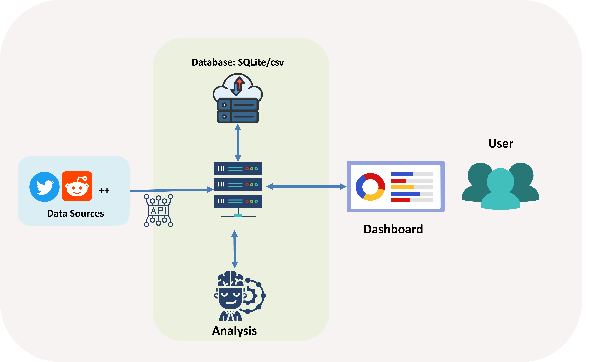

# Lie-brary
### "bringing clarity to the chaos of online information"

## What is Lie-brary?
Our project’s goal is to analyze subjects that were misconstrued on social media (such as health misinfo or backlash against a law) to understand the construction and spread of certain myths. We are also considering leveraging GPT/our own messaging templates to build communication to myth-bust and help counter misinformation.  Note that we will define misinformation on the basis of what has been fact-checked as false through [International Fact-Checking Network](https://www.poynter.org/ifcn/) approved sources and [InjusticeWatch](https://www.injusticewatch.org/news/prisons-and-jails/2022/safe-t-act-purge-law-illinois-fact-check/) (NGO advocating for SAFE-T Act).

