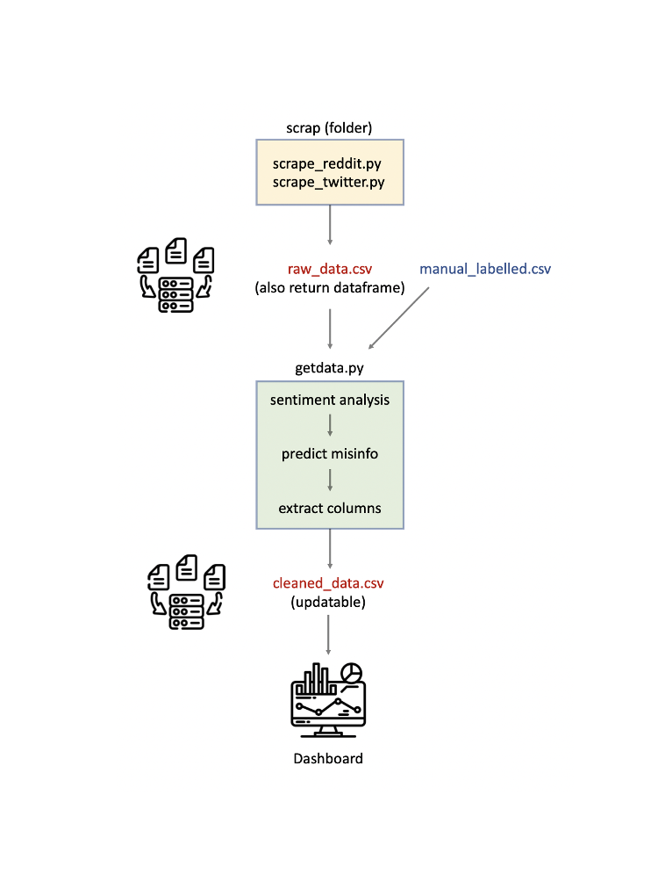

# Lie-brary
### "bringing clarity to the chaos of online information"

## What is Lie-brary?
Our project’s goal is to analyze subjects that were misconstrued on social media (such as health misinfo or backlash against a law) to understand the construction and spread of certain myths. We are also considering leveraging GPT/our own messaging templates to build communication to myth-bust and help counter misinformation.  Note that we will define misinformation on the basis of what has been fact-checked as false through [International Fact-Checking Network](https://www.poynter.org/ifcn/) approved sources and [InjusticeWatch](https://www.injusticewatch.org/news/prisons-and-jails/2022/safe-t-act-purge-law-illinois-fact-check/) (NGO advocating for SAFE-T Act).

## About the data
Our first step was to scrape data from social media sites, Twitter and Reddit, via their APIs. We attempted to scrape data from Meta but found that access to developers was extremely limited and largely restricted to Ads Library information -- which would mean that our data would not be balanced with other sources (inorganic Ads versus organic content from Reddit or Twitter). We already had access to a Twitter API key and found Reddit highly accessible which tipped the scales in favor of these platforms.

To ensure parallelism of our data, we also discounted YouTube or TikTok. This is because we pulled text/post information from Twitter and Reddit; the difference in entity types (videos/short reels) would corrupt our analysis as it would mean that our sample groups were unbalanced.

Note that the following impositions applied to scraping from these platforms:
- Twitter: the search index had a 7 day limit and pulled data only for the preceding week
- Reddit: limited pulls to 200 posts while using requests + difficulting in filtering specific keywords

## How our files interact?

## Process overview

## How to run the project?

### Using Poetry
1. Make the clone of the project repository
2. Go to the project directory: ``cd 30122-project-lie-brary``
3. From the directory install virtual environment and dependencies: ``poetry install``
4. Activate the virtual environment: ``poetry shell``
5. Fill credentials on ``30122-project-lie-brary/lie_brary/scripts/scrap/key.py`` or replace with filled key.py file 
6. Run the project:
- For running the dashboard: ``python3 -m lie_brary dashboard``
- For running the script to update the data: ``python3 -m lie_brary getdata``

**Note**: If you use windows, you can use ``python`` instead of ``python3``

### Using Python Virtual Environment
1. Make the clone of the project repository
2. Go to the project directory: ``cd 30122-project-lie-brary``
3. Create a virtual environment: ``python3 -m venv liebrary_env``
4. Activate the virtual environment: ``source liebrary_env/bin/activate``
5. Install the dependencies: ``pip install -r requirements.txt``
6. Fill credentials on ``30122-project-lie-brary/lie_brary/scripts/scrap/key.py`` or replace with filled key.py file
7. Run the project:
- For running the dashboard: ``python3 -m lie_brary dashboard``
- For running the script to update the data: ``python3 -m lie_brary getdata``

**Note**: Tested on Ubuntu with Python 3.8. (Not Recommended because more prone to errors)

## Links to live dashboard:
[Dashboard](http://rezarzky.my.id:8051/)
